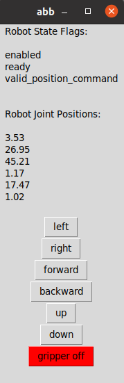

# Robot Raconteur (RR) Simple Robot Client

## Prerequisite:
* python2/python3 (`python` for python2, `python3` for python3, be aware of which one you're using)
* [qpsolvers](https://pypi.org/project/qpsolvers/) (`pip/pip3 install qpsolvers`)
* [Robot Raconteur](https://github.com/robotraconteur/robotraconteur/wiki/Download) (Follow instruction to download, depending on different OS)

## Instructions:
Start RR robot service, and make sure it's exposed to the network (checking by [RR Service Browser](https://github.com/robotraconteur/RobotRaconteur_ServiceBrowser))

Create robot orientation function under `\toolbox` if robot not included in the provided ones, named it `R_<robot_name>`.

Start the script:
`python gui_client_robot.py --robot-name=<robot_name>`.

The script will detect robot service through auto-discovery based on provided robot name, and also connecting to the tool service if available.
